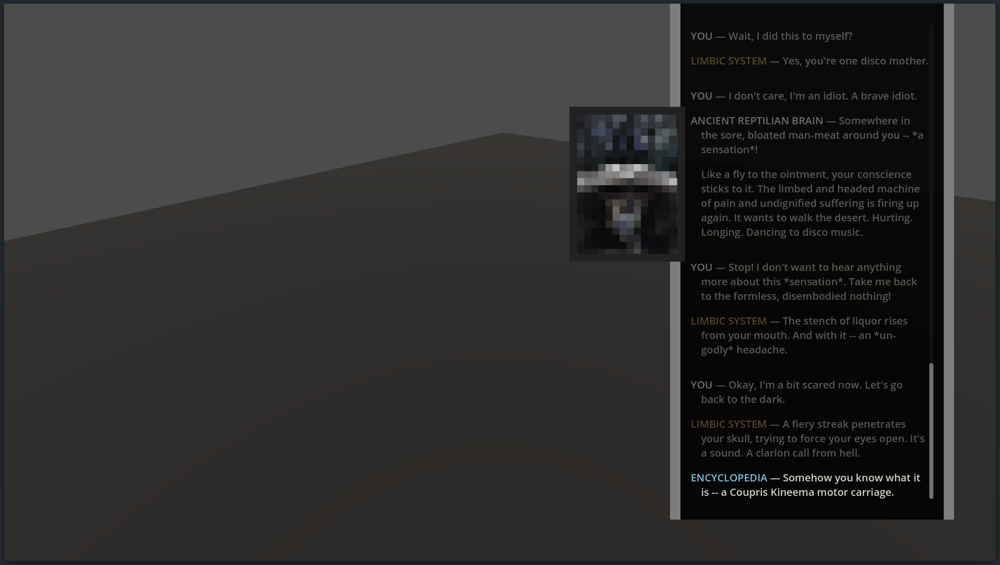

# Disco Elysium dialogue system example

This project is an example of how to implement a "Disco Elysium - like" dialogue system in [Godot](https://godotengine.org) using [Clyde](https://thisisvini.com/clyde).

This sample covers:

- Dialogue authoring
- Passive and Active checks 
- Interface and speaker configuration

For in-depth implementation details, [check this video](https://youtu.be/oimMfjTE5mM).

## About

This project was created as an example to help people trying to implement games like Disco Elysium. It also serves as a showcase of Clyde's capabilities.

The intro dialogue used was adapted from [https://fayde.co.uk](https://fayde.co.uk). This is the same intro dialogue from Disco Elysium and should only be used for learning purposes.

This project is distributed under [the MIT license](./LICENSE.md) so you can use it as you wish. Not a requirement, but if you end up doing anything cool with it I'd love to see it. Hit me up in one of my socials. You can find my contact info on [https://thisisvini.com/](https://thisisvini.com)
